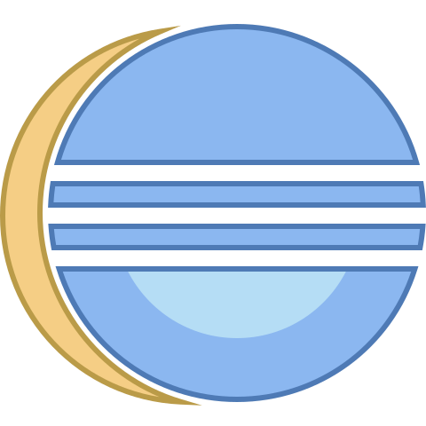
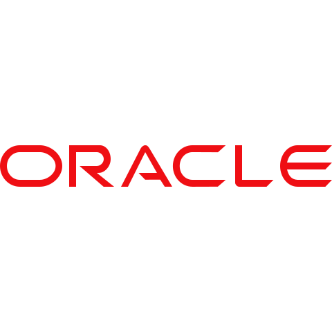

<h1 align="center">Hi 👋, I'm Vivek</h1>
<h3 align="center">A passionate full stack developer</h3>

- 🔭 I’m currently working as ASDE in **Mphasis**.

- 🌱 I’m currently learning **Rust**

- 📫 Reach me -> **viveklinganathan@gmail.com** or any of my social media handle

### General

- I'm also teaching blockchain technology as an overview to fellow people and having own set of group to teach and create awareness about cryptocurrency investments and strategies.  

- Also Scaling up myself to new technologies and looking for an opportunity to land in **Web3** Area.

### Blog posts
- Coming Soon :)
<!-- BLOG-POST-LIST:START -->
<!-- - [The story behind “MatchGame”](https://minipachru.medium.com/the-story-behind-matchgame-d038d5a8d1d1?source=rss-bdb34447e055------2)
- [Postmortem](https://minipachru.medium.com/postmortem-e6da3359b6ea?source=rss-bdb34447e055------2)
- [What’s the Big Deal? Specialization](https://minipachru.medium.com/whats-the-big-deal-specialization-bcb369951b15?source=rss-bdb34447e055------2)
- [What happens when you type holbertonschool.com](https://minipachru.medium.com/what-happens-when-you-type-holbertonschool-com-6e8447742da8?source=rss-bdb34447e055------2)
- [Internet of… what?](https://minipachru.medium.com/internet-of-what-19fc89ddfa87?source=rss-bdb34447e055------2) -->
<!-- BLOG-POST-LIST:END -->

<h3 align="center">Connect with me:</h3>

  
  
  <!--  -->
 <!--   -->
  

 

<h3 align="center">Tools</h3>

  
  
  
  
  
  
  

<h3 align="center">Languages and Frameworks</h3>

  
  
  
  
  
  
  

## 📈 Statistics

<!--  

  
  

	

 -->

